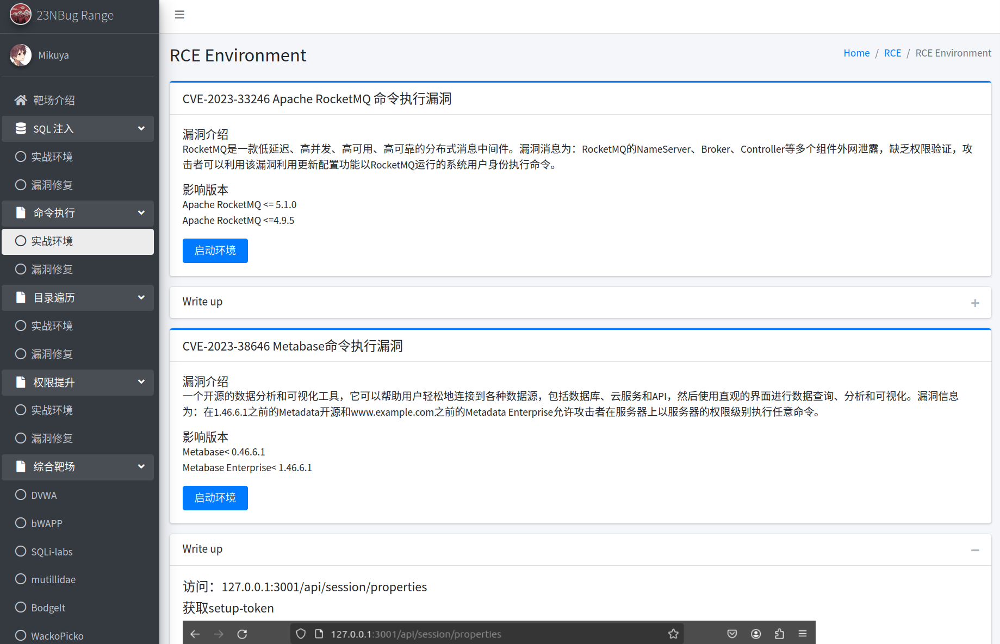
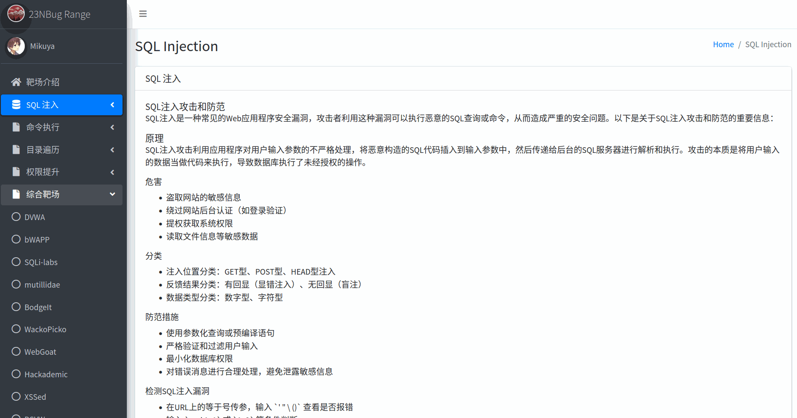

***

# 漏洞模拟实验平台

## 项目简介

漏洞模拟实验平台是一个基于 **Docker**、**Laravel** 和 **Vue** 开发的漏洞学习与实战平台。该项目旨在为安全研究人员、开发人员和学习者提供一个安全的实验环境，用于学习、复现和研究各种漏洞类型。平台提供了以下功能：

*   **漏洞介绍**：详细描述常见漏洞类型及其原理。
*   **实战环境**：通过 Docker 容器提供漏洞复现环境。
*   **修复建议**：针对每种漏洞提供修复方案和最佳实践。
*   **综合靶场**：集成多种漏洞环境，提供综合实战场景。
*   **CVE 复现**：复现常见 CVE 漏洞，并提供详细的复现过程。

***

## 项目特点

*   **模块化设计**：使用 Laravel 作为后端框架，Vue 作为前端框架，前后端分离，易于扩展和维护。
*   **Docker 集成**：所有漏洞环境均通过 Docker 容器化，确保环境隔离和快速部署。
*   **CVE 复现**：提供多个真实 CVE 漏洞的复现环境，帮助用户深入理解漏洞原理。
*   **用户友好**：提供清晰的漏洞介绍、复现步骤和修复建议，适合不同水平的学习者。

***

## 项目环境

*   Docker
*   Docker Compose
*   Apache2
*   PHP8.1
*   MySQL
*   Node.js 、npm
*   Composer
*   Laravel 9
*   Vue

***

## 漏洞环境列表

以下是当前支持的漏洞类型和 CVE 复现列表：

| 漏洞类型   | CVE复现                               |
| :----- | :---------------------------------- |
| SQL 注入 | CVE-2023-25157 GeoServer OGC Filter |
| 命令执行   | CVE-2023-33246 Apache RocketMQ      |
|        | CVE-2023-38646 Metabase             |
| 目录遍历   | CVE-2023-2825 GitLab                |
|        | CVE-2023-37474 copyparty            |
| 权限提升   | CVE-2023-22809 sudo提权漏洞             |

